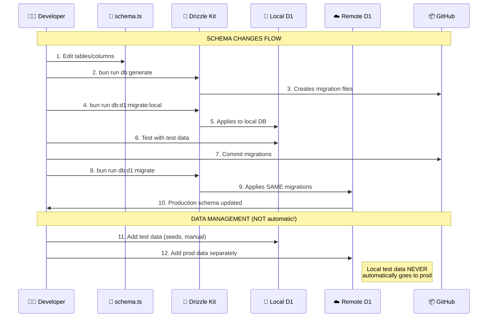
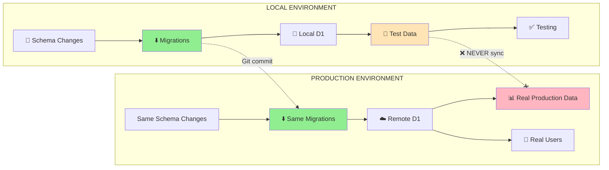
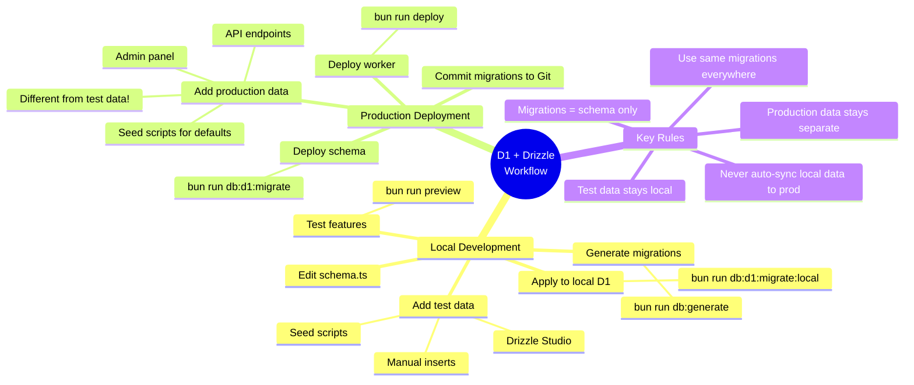

# Complete Step-by-Step Guide: SvelteKit + Cloudflare + Drizzle (2026)

Based on current Cloudflare and Svelte documentation, here's a fresh start-to-finish guide that works around the known Drizzle add-on issue and uses modern configuration (no `wrangler.toml`).

1. [Complete Step-by-Step Guide: SvelteKit + Cloudflare + Drizzle (2026)](#complete-step-by-step-guide-sveltekit--cloudflare--drizzle-2026)
   1. [The Problem You Encountered](#the-problem-you-encountered)
   2. [Step 1: Create the SvelteKit Project with `create-cloudflare`](#step-1-create-the-sveltekit-project-with-create-cloudflare)
   3. [Step 2: Install Drizzle and Dependencies](#step-2-install-drizzle-and-dependencies)
   4. [Step 3: Create the Database Schema](#step-3-create-the-database-schema)
   5. [Step 4: Create Database Connection Utilities](#step-4-create-database-connection-utilities)
   6. [Step 5: Configure Drizzle Kit](#step-5-configure-drizzle-kit)
   7. [Step 6: Configure wrangler.jsonc (No wrangler.toml!)](#step-6-configure-wranglerjsonc-no-wranglertoml)
   8. [Step 7: Set Up package.json Scripts](#step-7-set-up-packagejson-scripts)
   9. [Step 8: Create and Configure the D1 Database](#step-8-create-and-configure-the-d1-database)
      1. [First, create the D1 database:](#first-create-the-d1-database)
   10. [Step 9: Access D1 in Your SvelteKit App](#step-9-access-d1-in-your-sveltekit-app)
   11. [Step 10: Development Workflows](#step-10-development-workflows)
       1. [Option A: Local SQLite for Fast Development](#option-a-local-sqlite-for-fast-development)
       2. [Option B: Local D1 (Cloudflare Emulation)](#option-b-local-d1-cloudflare-emulation)
       3. [Option C: Production Deployment](#option-c-production-deployment)
   12. [Complete File Structure](#complete-file-structure)
   13. [Summary of Commands](#summary-of-commands)
   14. [Yes, `wrangler dev` with D1 uses a **local instance** by default](#yes-wrangler-dev-with-d1-uses-a-local-instance-by-default)
       1. [Default Behavior: Local D1 Instance](#default-behavior-local-d1-instance)
       2. [To Use Your Production D1 Database Locally (Not Recommended)](#to-use-your-production-d1-database-locally-not-recommended)
       3. [The Data Separation Model](#the-data-separation-model)
       4. [What About `preview_database_id`?](#what-about-preview_database_id)
       5. [Practical Workflow](#practical-workflow)
       6. [Important Gotchas](#important-gotchas)
       7. [Your Scripts Are Correct!](#your-scripts-are-correct)
   15. [Why You Can't Just "Push" Local D1 Data](#why-you-cant-just-push-local-d1-data)
   16. [The Correct Workflow: Migrations + Seeding](#the-correct-workflow-migrations--seeding)
       1. [Step 1: Schema Changes (Migrations)](#step-1-schema-changes-migrations)
       2. [Step 2: Data Management (The Real Answer to Your Question)](#step-2-data-management-the-real-answer-to-your-question)
          1. [Option A: Create a Seed Script (Recommended)](#option-a-create-a-seed-script-recommended)
          2. [Option B: Use SQL Dumps (For One-Time Data Transfer)](#option-b-use-sql-dumps-for-one-time-data-transfer)
          3. [Option C: Write a Sync Script (Advanced)](#option-c-write-a-sync-script-advanced)
   17. [The Standard D1 Workflow (Best Practice)](#the-standard-d1-workflow-best-practice)
       1. [Development Cycle:](#development-cycle)
       2. [For Production Data Management:](#for-production-data-management)
   18. [What About Data from Local Testing?](#what-about-data-from-local-testing)
   19. [Quick Reference Commands](#quick-reference-commands)
   20. [The Bottom Line](#the-bottom-line)
   21. [Key Process Explained Visually:](#key-process-explained-visually)
   22. [The Critical Concept:](#the-critical-concept)
   23. [Simple Summary in Mermaid Mind Map:](#simple-summary-in-mermaid-mind-map)
   24. [The "Noob-Friendly" Explanation:](#the-noob-friendly-explanation)

## The Problem You Encountered

You hit a known bug where the Svelte CLI's Drizzle add-on fails with an "Unexpected token" error when creating a project with Cloudflare D1 . This happens because the auto-generated database connection code conflicts with how Cloudflare bindings work. The solution is to set up the project first, then add Drizzle manually.

---

## Step 1: Create the SvelteKit Project with `create-cloudflare`

Use Cloudflare's C3 CLI to create the project. This automatically installs the Cloudflare adapter and Wrangler:

```bash
bun create cloudflare@latest my-svelte-app --framework=svelte
```

During setup, when prompted:

- Choose your SvelteKit template (recommend: "SvelteKit minimal" or "SvelteKit demo")
- Select TypeScript when asked

After creation, navigate into the project:

```bash
cd my-svelte-app
```

**What this gives you:** The Cloudflare adapter (`@sveltejs/adapter-cloudflare`) pre-installed, Wrangler configured, and a project ready for Cloudflare deployment .

---

## Step 2: Install Drizzle and Dependencies

Now add Drizzle manually (bypassing the broken CLI add-on):

```bash
# Core Drizzle packages
bun add drizzle-orm

# Drizzle Kit (for migrations)
bun add -d drizzle-kit

# For local SQLite testing (optional but recommended)
bun add @libsql/client
```

---

## Step 3: Create the Database Schema

Create your Drizzle schema file:

```typescript
// src/lib/server/db/schema.ts
import { sqliteTable, text, integer } from "drizzle-orm/sqlite-core"

export const users = sqliteTable("users", {
  id: integer("id").primaryKey({ autoIncrement: true }),
  name: text("name").notNull(),
  email: text("email").notNull().unique(),
  createdAt: integer("created_at", { mode: "timestamp" }).$default(
    () => new Date(),
  ),
})

// Add more tables as needed
export type User = typeof users.$inferSelect
export type NewUser = typeof users.$inferInsert
```

---

## Step 4: Create Database Connection Utilities

This is the crucial part that avoids the CLI bug. You need separate utilities for local testing and D1:

```typescript
// src/lib/server/db/index.ts
import type { D1Database } from "@cloudflare/workers-types"
import { drizzle as drizzleD1 } from "drizzle-orm/d1"

// For use in Cloudflare Workers/Pages (production + D1 local)
export const createDb = (database: D1Database) => drizzleD1(database)
```

```typescript
// src/lib/server/db/local.ts (for local SQLite testing only)
import { drizzle } from "drizzle-orm/libsql"
import { createClient } from "@libsql/client"

const client = createClient({
  url: "file:./local.db", // Simple SQLite file in project root
})

export const localDb = drizzle(client)
```

---

## Step 5: Configure Drizzle Kit

Create `drizzle.config.ts` in the project root:

```typescript
import { defineConfig } from "drizzle-kit"

export default defineConfig({
  schema: "./src/lib/server/db/schema.ts",
  out: "./drizzle",
  dialect: "sqlite",
  driver: "d1-http", // Required for D1 compatibility
  dbCredentials: {
    url: "file:./local.db", // Fallback for local SQLite
  },
})
```

---

## Step 6: Configure wrangler.jsonc (No wrangler.toml!)

Create `wrangler.jsonc` in your project root. Note the `.jsonc` extension - this allows comments:

```json
{
  "$schema": "node_modules/wrangler/config-schema.json",
  "name": "my-svelte-app",
  "compatibility_date": "2026-04-01",
  "compatibility_flags": ["nodejs_compat"],
  "pages_build_output_dir": ".svelte-kit/cloudflare",
  "d1_databases": [
    {
      "binding": "DB",
      "database_name": "my-app-db",
      "database_id": "your-database-id-from-step-8"
    }
  ],
  "observability": {
    "enabled": true
  }
}
```

**Important:** The `database_id` will be filled after you create the D1 database in Step 8.

---

## Step 7: Set Up package.json Scripts

Add these scripts to your `package.json`:

```json
{
  "scripts": {
    "dev": "vite dev",
    "build": "vite build",
    "preview": "bun run build && wrangler dev",
    "deploy": "bun run build && wrangler deploy",
    "cf-typegen": "wrangler types ./src/worker-configuration.d.ts",

    "db:generate": "drizzle-kit generate",

    "db:local:push": "drizzle-kit push",
    "db:local:studio": "drizzle-kit studio",
    "db:local:reset": "rm -f local.db && rm -rf .drizzle",

    "db:d1:setup": "wrangler d1 create my-app-db",
    "db:d1:setup:local": "wrangler d1 create my-app-db --local",
    "db:d1:migrate": "bun run db:generate && wrangler d1 migrations apply my-app-db --remote",
    "db:d1:migrate:local": "bun run db:generate && wrangler d1 migrations apply my-app-db --local"
  }
}
```

---

## Step 8: Create and Configure the D1 Database

### First, create the D1 database:

```bash
# Create local D1 database (for testing)
bun run db:d1:setup:local

# Create remote D1 database (for production)
bun run db:d1:setup
```

When you run `bun run db:d1:setup`, Wrangler will output a database ID. Copy this ID and paste it into the `database_id` field in your `wrangler.jsonc` file .

---

## Step 9: Access D1 in Your SvelteKit App

In your SvelteKit endpoints, access the D1 binding via the `platform` object:

```typescript
// src/routes/api/users/+server.ts
import { json } from "@sveltejs/kit"
import { createDb } from "$lib/server/db"
import { users } from "$lib/server/db/schema"

export async function GET({ platform }) {
  const db = createDb(platform.env.DB)
  const allUsers = await db.select().from(users)
  return json(allUsers)
}

export async function POST({ request, platform }) {
  const db = createDb(platform.env.DB)
  const data = await request.json()
  const newUser = await db.insert(users).values(data).returning()
  return json(newUser)
}
```

For using D1 in `+page.server.ts` or `+layout.server.ts` files:

```typescript
// src/routes/+page.server.ts
import { createDb } from "$lib/server/db"
import { users } from "$lib/server/db/schema"

export async function load({ platform }) {
  const db = createDb(platform.env.DB)
  const usersList = await db.select().from(users)
  return { users: usersList }
}
```

---

## Step 10: Development Workflows

### Option A: Local SQLite for Fast Development

Use this when you don't need Cloudflare bindings:

```bash
# Create/update local database
bun run db:local:push

# Open Drizzle Studio to view data
bun run db:local:studio

# Run dev server
bun run dev
```

### Option B: Local D1 (Cloudflare Emulation)

Use this to test with actual Cloudflare bindings locally:

```bash
# Run migrations on local D1
bun run db:d1:migrate:local

# Start preview server with D1 bindings
bun run preview
```

While `wrangler dev` is running, press `e` in the terminal to open **Local Explorer** - a browser-based interface at `/cdn-cgi/explorer` where you can browse tables, run SQL queries, and edit data in your local D1 database .

### Option C: Production Deployment

```bash
# Run migrations on remote D1
bun run db:d1:migrate

# Deploy to Cloudflare
bun run deploy
```

---

## Complete File Structure

After following this guide, your project should look like:

```
my-svelte-app/
├── src/
│   ├── lib/
│   │   └── server/
│   │       └── db/
│   │           ├── index.ts          # D1 connection factory
│   │           ├── local.ts          # Local SQLite connection
│   │           └── schema.ts         # Your Drizzle schema
│   ├── routes/
│   │   ├── +page.server.ts           # Loader with D1 access
│   │   └── api/
│   │       └── users/
│   │           └── +server.ts        # API endpoint with D1
│   └── app.html
├── drizzle/
│   └── migrations/                   # Generated migrations
├── wrangler.jsonc                    # Cloudflare config (no .toml!)
├── drizzle.config.ts                 # Drizzle Kit config
├── svelte.config.js                  # Already has Cloudflare adapter
├── package.json
└── tsconfig.json
```

---

## Summary of Commands

| Command                       | Purpose                          |
| ----------------------------- | -------------------------------- |
| `bun run db:generate`         | Generate migrations from schema  |
| `bun run db:local:push`       | Push schema to local SQLite      |
| `bun run db:local:studio`     | Open Drizzle Studio for local DB |
| `bun run db:d1:migrate:local` | Run migrations on local D1       |
| `bun run db:d1:migrate`       | Run migrations on production D1  |
| `bun run dev`                 | Start dev server (SQLite only)   |
| `bun run preview`             | Preview with D1 bindings         |
| `bun run deploy`              | Deploy to Cloudflare             |

This setup avoids the CLI bug entirely while giving you full control over both local development and Cloudflare D1 production deployment.

Great question! You're thinking in the right direction. Based on the current docs, here's the straight answer:

## Yes, `wrangler dev` with D1 uses a **local instance** by default

When you run `bun run preview` (which runs `wrangler dev`), you are **not** connecting to your production D1 database. Instead, you get a local, isolated D1 instance that runs on your machine using Miniflare (Cloudflare's local simulator).

Here's how it works:

### Default Behavior: Local D1 Instance

```bash
bun run preview
# This runs: bun run build && wrangler dev
# D1 binds to a LOCAL database - NOT production
```

When you run `wrangler dev` without any special flags:

- Creates a new, empty local D1 database on your machine
- Runs completely offline (no Cloudflare network connection)
- Uses Miniflare to simulate the exact same D1 runtime as production
- Data persists between `wrangler dev` sessions by default

### To Use Your Production D1 Database Locally (Not Recommended)

If you _want_ to connect to your **real production database** during local development, you'd need to pass the `--remote` flag:

```bash
wrangler dev --remote
```

But the official docs warn against this because **any changes you make cannot be undone** (no rollbacks on D1 writes).

### The Data Separation Model

This is how D1 keeps things clean:

| Command                                 | Database Used        | Use Case                             |
| --------------------------------------- | -------------------- | ------------------------------------ |
| `wrangler dev` (your `bun run preview`) | Local D1 (Miniflare) | Testing features, schema changes     |
| `wrangler dev --remote`                 | Production D1        | ⚠️ Dangerous - debugging prod issues |
| `wrangler d1 execute ...` (no flag)     | Production D1        | Production management                |
| `wrangler d1 execute ... --local`       | Local D1             | Local testing                        |

### What About `preview_database_id`?

The `preview_database_id` field in your config **only affects `wrangler dev`**. If you set it, you can share a local database across your team or persist it in a specific location:

```json
{
  "d1_databases": [
    {
      "binding": "DB",
      "database_name": "my-app-db",
      "database_id": "your-prod-id",
      "preview_database_id": "your-preview-id" // Only for local dev
    }
  ]
}
```

Even with this set, `wrangler dev` still uses a local database — it just gives you control over _which_ local database file gets used.

### Practical Workflow

**For daily development** (what you'll mostly do):

```bash
# 1. Set up your local database schema
bun run db:d1:migrate:local   # Runs migrations on local D1

# 2. Start local dev with D1 bindings
bun run preview                # Uses your local D1 instance

# 3. Populate with test data
bun run db:local:studio        # Or run seed scripts
```

**To reset your local D1 database**:

```bash
# Just delete the local D1 storage
rm -rf .wrangler/state/v3/d1
```

**When you're ready for production**:

```bash
# Deploy schema to production D1
bun run db:d1:migrate          # Targets remote DB (no --local flag)

# Deploy your worker
bun run deploy
```

### Important Gotchas

1. **Local D1 is not production D1**: The local instance is empty initially. You'll need to seed it with test data.

2. **Data persists by default**: Your local test data sticks around between `wrangler dev` sessions. To start fresh, delete the `.wrangler/state` folder.

3. **Preview deployments ≠ Local dev**: When you open a PR and Cloudflare builds a preview deployment, that's a different story. Preview deployments use your production database by default unless you explicitly configure staging environments.

4. **Schema changes are local-first**: You can generate and test migrations locally, then apply them to production separately. This is why your scripts have separate `--local` and (no flag) versions for migrations.

### Your Scripts Are Correct!

The scripts from the previous guide properly separate local and production:

```json
"db:d1:migrate:local": "bun run db:generate && wrangler d1 migrations apply my-app-db --local",
"db:d1:migrate": "bun run db:generate && wrangler d1 migrations apply my-app-db --remote"
```

- `--local` flag → affects your local dev D1 (safe, fast)
- No flag or `--remote` → affects your production D1 (use carefully)

So yes — when you're developing locally with `bun run preview`, you're working with a completely safe, local copy of D1. Your production data stays untouched until you explicitly run migrations or deploy with `--remote` flags.

Good question! The short answer is: **you can't directly push local data to remote D1** - you need to use migrations and seed scripts. Here's why and how to handle it properly.

## Why You Can't Just "Push" Local D1 Data

Local D1 and remote D1 are **completely separate databases** with different:

- File locations (local is on your machine, remote is on Cloudflare's network)
- Data contents (local has test data, remote has production data)
- Connection methods (local uses Miniflare, remote uses actual D1 API)

You can't just copy the local `.db` file to production - that would break everything.

## The Correct Workflow: Migrations + Seeding

### Step 1: Schema Changes (Migrations)

When you change your schema locally, you generate and test migrations:

```bash
# 1. Change your schema in schema.ts
# 2. Generate migration files
bun run db:generate

# 3. Test migration on local D1 first
bun run db:d1:migrate:local

# 4. Verify everything works locally
bun run preview
```

Then apply the **same migrations** to remote:

```bash
# 5. Apply to production D1
bun run db:d1:migrate
```

**Important:** This only changes the schema structure, not the data.

### Step 2: Data Management (The Real Answer to Your Question)

For moving data from local to remote, you have several options:

#### Option A: Create a Seed Script (Recommended)

Create `scripts/seed.ts`:

```typescript
// scripts/seed.ts
import { createDb } from "../src/lib/server/db"
import { users } from "../src/lib/server/db/schema"

// For local seeding
async function seedLocal() {
  // Your local test data
  const testUsers = [
    { name: "Test User 1", email: "test1@example.com" },
    { name: "Test User 2", email: "test2@example.com" },
  ]

  // This runs against your local D1
  // You'd need to adapt this based on your setup
  console.log("Seeding local D1...")
  // Implementation depends on your D1 access method
}

// For production seeding
async function seedProduction() {
  // Ask for confirmation first!
  console.log("⚠️  This will add data to PRODUCTION D1")
  console.log("Press Ctrl+C to cancel or Enter to continue")
  await Bun.stdin.text()

  // Your production seed data
  const initialData = [{ name: "Admin User", email: "admin@example.com" }]

  // Apply to production D1 via wrangler
  // Using wrangler d1 execute with SQL
}

// Run based on command line arg
if (process.argv.includes("--local")) {
  seedLocal()
} else if (process.argv.includes("--remote")) {
  seedProduction()
}
```

Add to package.json:

```json
"db:seed:local": "bun run scripts/seed.ts --local",
"db:seed:remote": "bun run scripts/seed.ts --remote"
```

#### Option B: Use SQL Dumps (For One-Time Data Transfer)

Export data from local D1:

```bash
# Export local data to SQL file
wrangler d1 execute my-app-db --local --command=".dump" > local-backup.sql
```

**⚠️ WARNING:** Don't just import this to production! Clean it up first:

```bash
# Extract only INSERT statements (exclude schema)
grep "^INSERT" local-backup.sql > data-only.sql

# Review the data carefully!
cat data-only.sql

# Apply to remote (if you're sure)
wrangler d1 execute my-app-db --file=data-only.sql
```

#### Option C: Write a Sync Script (Advanced)

Create `scripts/sync-local-to-remote.ts`:

```typescript
// This is a complex operation - use with extreme caution!
import { localDb } from "../src/lib/server/db/local"
import { createDb } from "../src/lib/server/db"

async function syncData() {
  console.log("🔴 WARNING: This will overwrite production data")
  console.log('Type "CONFIRM" to continue:')

  const confirmation = await Bun.stdin.text()
  if (confirmation.trim() !== "CONFIRM") {
    console.log("Sync cancelled")
    return
  }

  // Read data from local
  const localUsers = await localDb.select().from(users)

  // Connect to production (needs proper D1 binding)
  // This is tricky in scripts - better to use wrangler commands

  console.log(`Would sync ${localUsers.length} users to production`)
  // Implementation would require proper D1 client setup
}
```

## The Standard D1 Workflow (Best Practice)

Here's what most teams actually do:

### Development Cycle:

```bash
# 1. Work locally with test data
bun run preview

# 2. Make schema changes
bun run db:generate
bun run db:d1:migrate:local

# 3. Test everything with local D1
# ... develop features ...

# 4. For production, only apply schema changes
bun run db:d1:migrate
```

### For Production Data Management:

```bash
# To add initial/seed data to production
bun run db:seed:remote

# To update production data (use D1's UPDATE/INSERT directly)
wrangler d1 execute my-app-db --command="UPDATE users SET status='active' WHERE id=1"

# NEVER try to "sync" local test data to production
```

## What About Data from Local Testing?

**You generally don't want to push local test data to production.** Local data is:

- Fake/test data (emails like `test@example.com`)
- Created for edge cases
- Potentially insecure (passwords, tokens)

Instead, you should:

1. **Keep migrations separate** from data
2. **Create production seeds** that are safe for real users
3. **Use the D1 dashboard** or SQL to add production data manually when needed

## Quick Reference Commands

| What you want                  | Command                                                         |
| ------------------------------ | --------------------------------------------------------------- |
| Apply schema changes to remote | `bun run db:d1:migrate`                                         |
| Apply schema changes to local  | `bun run db:d1:migrate:local`                                   |
| See local D1 data              | `bun run db:local:studio`                                       |
| See remote D1 data             | `wrangler d1 execute my-app-db --command="SELECT * FROM users"` |
| Run SQL on remote              | `wrangler d1 execute my-app-db --command="your sql"`            |
| Run SQL on local               | `wrangler d1 execute my-app-db --local --command="your sql"`    |

## The Bottom Line

**You cannot "push" local D1 data to remote D1** because they're separate database instances. Instead:

- Use **migrations** for schema changes
- Use **seed scripts** for data
- Keep test data local
- Create proper production data separately

If you absolutely need to move specific local data to production (like configuration records), export them as INSERT statements, review carefully, and apply them manually. But in practice, you'll almost never want to directly copy your test data to production.

Here's a Mermaid diagram that explains the complete D1 + Drizzle workflow for local development and production:

```mermaid
flowchart TD
    subgraph "YOUR LOCAL MACHINE"
        A[📝 Edit schema.ts<br/>Add/change tables] --> B[🏃 Run: bun run db:generate]
        B --> C[📁 Drizzle generates migration files<br/>in /drizzle folder]
        C --> D{Which environment?}

        D -->|Local Testing| E[🏃 Run: bun run db:d1:migrate:local]
        D -->|Production| F[🏃 Run: bun run db:d1:migrate]

        E --> G[🖥️ LOCAL D1 Database<br/>(SQLite file via Miniflare)]
        F --> H[☁️ REMOTE D1 Database<br/>(Cloudflare's network)]

        G --> I[🧪 Test with test data<br/>bun run preview]

        I --> J{Changes work?}
        J -->|No| A
        J -->|Yes| K[📦 Commit migration files to Git]

        K --> L[🚀 Deploy to Cloudflare<br/>bun run deploy]
        L --> H
    end

    subgraph "DEVELOPMENT WORKFLOWS"
        M[💻 Daily Development] --> N[Use local D1<br/>bun run preview]
        N --> O[Add test data manually<br/>or via seed script]
        O --> P[Test features]
        P --> Q[Make schema changes<br/>repeat migration cycle]
    end

    subgraph "PRODUCTION DATA MANAGEMENT"
        R[📊 Production data] --> S{Need to add data?}
        S -->|Initial setup| T[Create seed script<br/>with production-safe data]
        S -->|Ongoing| U[Use D1 dashboard<br/>or SQL commands]
        T --> V[Run: bun run db:seed:remote]
        U --> W[wrangler d1 execute<br/>my-app-db --command='...']
    end

    style G fill:#90EE90
    style H fill:#FFB6C1
    style J fill:#FFD700
    style A fill:#87CEEB
```

## Key Process Explained Visually:



## The Critical Concept:



## Simple Summary in Mermaid Mind Map:



## The "Noob-Friendly" Explanation:

```mermaid
flowchart TD
    subgraph "YOUR LOCAL MACHINE"
        A["Edit schema.ts / Add or change tables"] --> B["Run: bun run db:generate"]
        B --> C["Drizzle generates migration files in /drizzle folder"]
        C --> D{Which environment?}
        D -->|Local Testing| E["Run: bun run db:d1:migrate:local"]
        D -->|Production| F["Run: bun run db:d1:migrate"]
        E --> G["LOCAL D1 Database (SQLite file via Miniflare)"]
        F --> H["REMOTE D1 Database (Cloudflare network)"]
        G --> I["Test with test data / bun run preview"]
        I --> J{Changes work?}
        J -->|No| A
        J -->|Yes| K["Commit migration files to Git"]
        K --> L["Deploy to Cloudflare / bun run deploy"]
        L --> H
    end

    subgraph "DEVELOPMENT WORKFLOWS"
        M["Daily Development"] --> N["Use local D1 / bun run preview"]
        N --> O["Add test data manually or via seed script"]
        O --> P["Test features"]
        P --> Q["Make schema changes / repeat migration cycle"]
    end

    subgraph "PRODUCTION DATA MANAGEMENT"
        R["Production data"] --> S{Need to add data?}
        S -->|Initial setup| T["Create seed script with production-safe data"]
        S -->|Ongoing| U["Use D1 dashboard or SQL commands"]
        T --> V["Run: bun run db:seed:remote"]
        U --> W["wrangler d1 execute my-app-db --command"]
    end

    style G fill:#90EE90
    style H fill:#FFB6C1
    style J fill:#FFD700
    style A fill:#87CEEB
```



**Key Takeaway:**

- **Migrations** = blueprint for your database structure (moves automatically)
- **Test data** = fake numbers you type in for testing (stays local)
- **Production data** = real user data (stays in Cloudflare)

They never mix automatically - you have to add production data separately through admin panels, seed scripts, or direct SQL commands!
